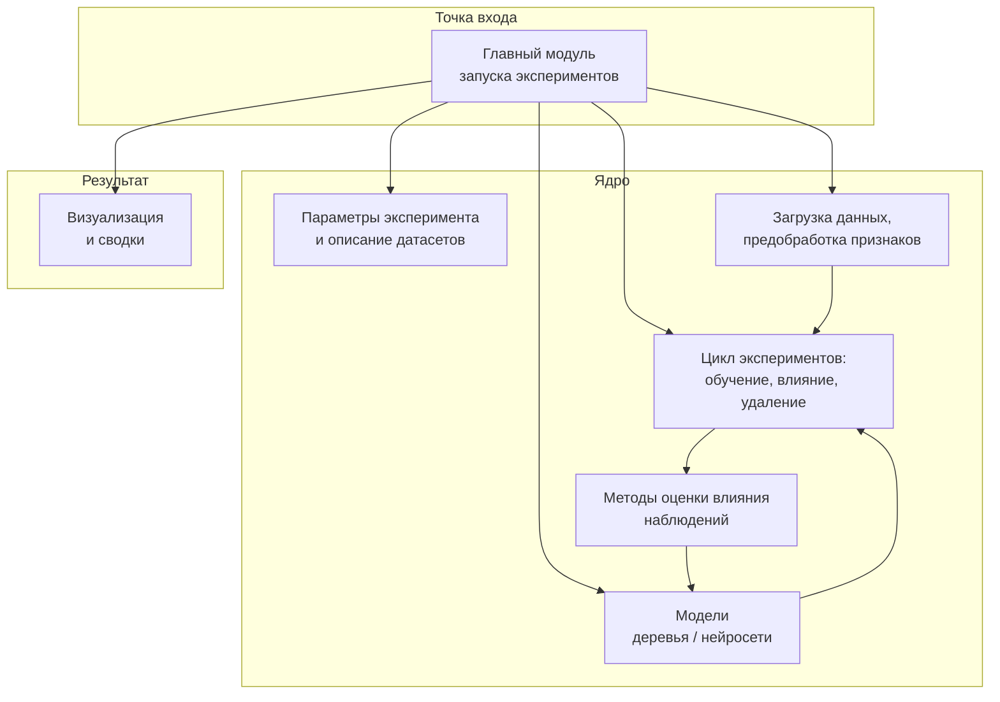
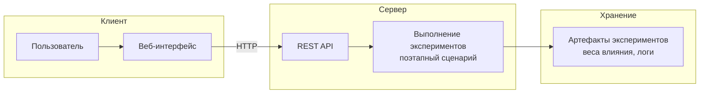
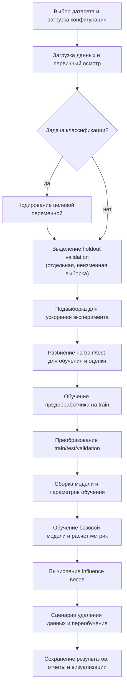
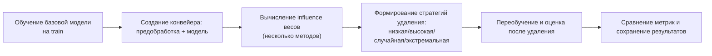

# Схемы программного комплекса

Ниже — обобщённые диаграммы для включения в пояснительную записку: модульная структура, взаимодействие компонентов микросервиса и этапы обработки данных при запуске из главного модуля.

**Готовые файлы для вставки** (SVG и PNG) и исходники `.mmd` — в каталоге [`architecture_diagrams/`](architecture_diagrams/); кратко по форматам — в [`architecture_diagrams/README.md`](architecture_diagrams/README.md).

Дальше тот же текст в виде Mermaid в Markdown (удобно править и смотреть в GitHub / VS Code).

---

## 1. Модульная структура ПО

Главный модуль связывает настройки, подготовку данных, построение моделей и блок оценки влияния объектов обучения; результаты выводятся в виде отчётов и графиков.

---

## 2. Микросервис: взаимодействие компонентов

Пользователь работает через веб-интерфейс; запросы идут к программному интерфейсу приложения, где в фоне выполняется сценарий эксперимента; итоги сохраняются на диск.

*Поэтапный сценарий на сервере:* загрузка данных → разбиение и выборка → предобработка → настройка модели → расчёт baseline, влияния и сценариев удаления → сохранение.

---

## 3. Этапы обработки данных при запуске главного модуля

Расширенный поток данных показывает точные этапы подготовки, обучения и оценки.

### Внутренний цикл эксперимента

После подготовки данных выполняется последовательность: базовое обучение, создание конвейера, расчёт influence, проверка стратегий удаления и сравнение результатов.

---

*Примечание.* Для Word обычно вставляют PNG или SVG из папки `architecture_diagrams/`; подпись к рисунку оформляют средствами редактора (ГОСТ).
