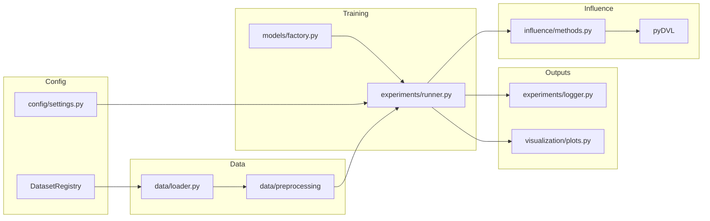

# Полное описание программной системы оценки влияния данных и кривых удаления

Документ описывает реализацию в репозитории дипломного проекта: от точки входа `main.py` до микросервиса FastAPI/Streamlit. Все пути к файлам указаны относительно корня проекта.

---

## 1. Введение и постановка задачи

### 1.1. Научная цель

Система предназначена для **эмпирического сравнения методов оценки «важности» обучающих точек и проверки стратегий их **последовательного удаления**: как меняется качество модели на отложенных данных, если удалять сначала объекты с наименьшим/наибольшим влиянием, случайно, по величине loss и т.д.

Используются:

- **Valuation** (оценки ценности данных) из библиотеки **pyDVL** — Leave-One-Out, Shapley, Beta-Shapley, Banzhaf, TMC-Shapley, Least Core и др.
- **Influence functions** для моделей **PyTorch** — прямые и приближённые варианты (LISSA, Nyström, Arnoldi, CG).

Код интеграции: `influence/methods.py` (класс `InfluenceMethods`, обёртка `SafeModelWrapper` для устойчивости valuation к пустым подвыборкам).

### 1.2. Границы реализации

- **Influence (Hessian-based)** в этом проекте вычисляется для **нейросетей** (`torch.nn.Module`), извлекаемых из обёртки (`InfluenceMethods._extract_torch_model`): учитывается `student_model` при дистилляции.
- **Valuation** строится через `ModelUtility` + `SupervisedScorer` и работает с любыми моделями, для которых корректно `clone`/`fit`/`predict` (в т.ч. деревья после обёртки в `SafeModelWrapper`).
- Отдельные методы pyDVL **намеренно отключены** в коде: например, `KNNShapley` пропускается для регрессии, `DataOOB` — из-за требований к `BaggingModel` (см. ветки `continue` в `setup_methods`).

---

## 2. Архитектура системы

### 2.1. Поток данных и управления



### 2.2. Роль модулей

| Модуль | Назначение |
|--------|------------|
| `config/settings.py` | Единая точка глобальных флагов: датасет, режим подгонки модели, эксперимент, influence, метрики, дистилляция, adaptive removal. |
| `config/datasets/` | `BaseDatasetConfig`, конкретные классы датасетов, `DatasetRegistry` (`config/datasets/__init__.py`). |
| `data/loader.py` | `DataLoaderFactory.load_dataset` вызывает `dataset_config.load_data()` и валидацию. |
| `data/preprocessing/` | `PreprocessorFactory` — пайплайн под задачу (таблица/текст/изображения). |
| `models/factory.py` | Создание LightGBM, XGBoost, CatBoost, RandomForest, `PyTorchModelWrapper`, `DistilledModelWrapper`. |
| `experiments/runner.py` | `ExperimentRunner`: baseline → influence → removal (+ random baseline). |
| `experiments/logger.py` | Каталог эксперимента, `results.pkl`, логи, сохранение весов influence. |
| `influence/methods.py` | Настройка pyDVL и расчёт векторов scores. |
| `visualization/plots.py` | Графики для CLI-запуска. |
| `microservice/` | HTTP API, Streamlit UI, хранилище экспериментов, форматирование графиков. |

---

## 3. Точка входа CLI: `main.py`

Последовательность:

1. **`CURRENT_DATASET`** или аргумент `--dataset` → `DatasetRegistry.get(name)`.
2. `set_random_seeds(RANDOM_STATE)`, создание `ExperimentLogger(EXPERIMENTS_BASE_DIR)`.
3. **`DataLoaderFactory.load_dataset`** → `X`, `y`, `cfg`.
4. Для классификации при необходимости **LabelEncoder** целевой переменной.
5. **Первый сплит**: из `(X, y)` отделяется **holdout validation** (`test_size = cfg.val_size`, опционально `stratify`).
6. От оставшегося берётся доля **`sample_size_percentage`** (`utils.helpers.sample_data`).
7. **Второй сплит**: train / test для обучения и промежуточной оценки (`EXPERIMENT_CONFIG['test_size']`).
8. **`PreprocessorFactory.create`**, `fit` на train, `transform` на train/test/holdout.
9. Определение **`input_size`**, слияние **`get_model_config(dataset_name, model_type)`** с `MODEL_RUN_CONFIG`, расчёт **`pos_weight`** для бинарной PyTorch.
10. **`n_epochs`**: для PyTorch/дистилляции — из `EXPERIMENT_CONFIG` или `FIT_MODE_EPOCHS` при `MODEL_FIT_MODE != 'normal'`; для деревьев фактически **1** (эпохи не используются).
11. **`ExperimentRunner.run_experiments`** → результаты, scores, `random_run_results`.
12. Сохранение: `logger.save_results`, `save_removal_metrics_csv`, графики, `logger.generate_summary`.

Важно: в `main` **holdout** (`X_holdout_validation`) передаётся в роли **`X_val`** в runner — это финальная оценка **`final_metric`**. Пара **`X_test`, `y_test`** внутри `train_and_evaluate` для PyTorch используется как **данные для поэпохальной метрики и early stopping** (в `history` поле называется `'val'`, но считается на `X_test`).

---

## 4. Цикл `ExperimentRunner.run_experiments` (`experiments/runner.py`)

### 4.1. Фаза baseline

- **`train_and_evaluate`**: фиксируется seed (`set_random_seeds`), при необходимости **`StandardScaler` на y** только для регрессии.
- PyTorch: цикл по эпохам, метрика на **`X_test`**, early stopping (patience 70), сохранение лучших весов по метрике на «val» (тестовом сплите). Затем **`final_metric`** на **`X_val`/`y_val`** (holdout).
- Деревья/дистилляция: одно обучение, метрика на тестовом сплите в `history['val']`, затем `final_metric` на holdout.

Результат baseline кладётся в **`self.results['orig']`**.

### 4.2. Фаза influence

1. Собирается **`Pipeline(preprocessor, model)`**.
2. **`InfluenceMethods.setup_methods`**: pyDVL `Dataset` из train + **validation для скорера** — в вызов передаются **`X_test`, `y_test`** из `run_experiments` как `X_val`, `y_val` аргументы метода (имена параметров совпадают с «валидацией скорера», но фактически это **тот же test split из main**).
3. **`compute_scores`**: заполнение словарей **`scores`** (для removal) и **`scores_raw`** (копии/логирование).
4. Опционально **top/bottom** примеров в лог (`show_top_bottom_influence`).
5. **Loss-бейзлайны**: `compute_per_sample_loss` → ключи **`LossHigh`**, **`LossLow`** (маппинг из `loss_high`/`loss_low` в settings через `get_selected_loss_removal_methods`).
6. Опционально **CatBoost object importance** → `CatBoostInfluence`.
7. Сохранение весов в каталог эксперимента (`logger.save_influence_weights_to_experiment_dir`).

### 4.3. Режим `run_mode`

- **`full`** (по умолчанию): после influence вызывается **`_run_removal_phase`**.
- **`influence_only`**: removal пропускается, возвращаются пустые `random_run_results`.

### 4.4. Фаза removal (`_run_removal_phase`)

- Для каждой комбинации **метода оценки** и **стратегии** (для influence-методов) или одной серии для valuation/loss:
  - По списку **`n_remove_list`** (проценты от **исходного** размера train): вычисляется **`n_to_remove`**, ограничение **минимум 10 оставшихся** точек (`n_train - 10`).
  - Строится порядок кандидатов (см. раздел 6).
  - Маска `keep_mask`, обучение на **`X_sub`, `y_sub`**.
  - **`_train_best_of_n`**: для PyTorch до **`n_retrain_runs`** раз с разными seed, выбирается лучший по **`final_metric`** на holdout; для деревьев один прогон.

**Ключи в `self.results`:**

- Базовая точка: **`{plot_method}_0`** = копия `orig`.
- После удаления **`pct`%**: **`{plot_method}_{pct}pct`**, например `Influence_lowest_10pct`, `LissaInfluence_extremes_25pct`, `LossHigh_10pct`, `DataShapley_10pct`.
- Для стратегий `few_*` короткие суффиксы в имени: `_few_bad_rand`, `_few_median_rand`, `_few_good_rand` (см. код присвоения `plot_method`).

### 4.5. Случайное удаление

Если в **`removal_strategies`** есть **`random`**:

- Для каждого **`run_idx`** в `0 .. n_random_runs-1` и каждого `pct` — перемешивание индексов, те же ограничения по классам/стратам.
- Ключи: **`random_{pct}pct_run{run_idx}`** с полным `history`.
- Затем для каждого `pct` вычисляется **медиана** `final_mae` по прогонам (поле в истории дублирует метрику: **`final_mae`** и **`final_metric`** для совместимости), результат записывается в **`random_{pct}pct`** как `{'final_mae': median}` для агрегированной кривой.

---

## 5. Настройка эксперимента (глоссарий `config/settings.py`)

### 5.1. Датасет и режим модели

| Переменная | Смысл |
|------------|--------|
| `CURRENT_DATASET` | Имя из реестра: `adult`, `housing`, `wine`, `zillow`, `covertype`, `electric`, `mnist`, `imdb`, `cifar10`. |
| `MODEL_FIT_MODE` | `normal` / `underfit` / `overfit` — выбор блока в `DATASET_MODEL_CONFIGS[dataset][mode]`. |
| `FIT_MODE_EPOCHS` | Переопределение числа эпох PyTorch/дистилляции вне `normal`. |

`get_model_config(dataset_name, model_type)` возвращает словарь гиперпараметров для выбранного типа модели с учётом `MODEL_FIT_MODE`.

### 5.2. Запуск модели и стратегии удаления (`MODEL_RUN_CONFIG`)

| Ключ | Смысл |
|------|--------|
| `model_type` | `lightgbm`, `xgboost`, `random_forest`, `catboost`, `pytorch`. |
| `model_architecture` | Для PyTorch: `simple`, `improved`, `ft_transformer`, и т.д. (должен существовать ключ с конфигом слоёв в `model_params`). |
| `removal_strategies` | Список: `lowest`, `highest`, `random`, `extremes`, `median`, `few_bad_then_random`, `few_median_then_random`, `few_good_then_random`. |
| `removal_per_class` | Классификация: ранжирование и квоты удаления **внутри каждого класса**. |
| `removal_stratify_target` | Регрессия: страты по квантилям **y** (`pd.qcut`). |
| `removal_stratify_n_bins` | Число бинов для квантильных страт. |

`REMOVAL_STRATEGIES` — ссылка на тот же список для скриптов.

### 5.3. `EXPERIMENT_CONFIG`

| Ключ | Смысл |
|------|--------|
| `test_size`, `val_size` | Доли test и holdout относительно этапов в `main` (см. раздел 3). |
| `n_epochs` | Максимум эпох PyTorch (может быть сокращён early stopping). |
| `sample_size_percentage` | Доля данных после holdout, идущая в эксперимент. |
| `n_remove_linspace` | `(start, stop, num)` → `np.linspace` **целых процентов** удаления (`get_n_remove_list`). |
| `n_random_runs` | Число независимых траекторий random removal. |
| `n_retrain_runs` | Число переобучений на каждом шаге removal для PyTorch; лучший по holdout. |
| `loss_removal_methods` | Подмножество `loss_high`, `loss_low` → `LossHigh`/`LossLow`. |
| `use_catboost_influence` | Включить вектор CatBoost для сравнения. |
| `show_top_bottom_influence` | Число примеров для вывода в лог; может переопределяться в конфиге датасета. |

### 5.4. Метрики

- **`METRIC_CONFIG`**: для каждого `task_type` — имя основной метрики (`mae`, `f1`, `accuracy`, …).
- **`METRIC_METADATA`**: подписи и **`higher_is_better`** для сравнения кривых и valuation removal.
- **`get_selected_metric(task_type, available_metrics)`** — проверяет, что метрика разрешена списком `cfg.metrics` датасета.
- **`get_metric_metadata(metric_name)`** — метаданные для графиков.

### 5.5. Influence и pyDVL

- **`INFLUENCE_METHODS_CONFIG`**: `valuation_methods`, `influence_methods` — строковые имена, совпадающие с ветками в `setup_methods`.
- **`PYDVL_CONFIG`**: `n_steps`, `rtol`, `max_updates`, параметры сэмплеров для Shapley/Banzhaf/TMC/LeastCore, **`influence_params`** (регуляризация, батчи, LISSA/CG/Arnoldi/Nyström).
- **`DATASET_INFLUENCE_PARAMS`**: переопределения по имени датасета; **`get_influence_params(dataset_name)`** возвращает копию.

В комментариях в settings **CgInfluence** помечен как очень медленный — это ограничение стоимости, не ошибка реализации.

### 5.6. Дистилляция (`DISTILLATION_CONFIG`)

`use_distillation`, `distillation_epochs`, `temperature`, `student_architecture` — teacher обучается как дерево, student как сеть; influence берётся с **student** при наличии `student_model`.

### 5.7. Адаптивная модель при removal (`REMOVAL_ADAPTIVE_CONFIG`)

См. раздел 8. Функции **`get_n_remove_list`**, **`get_selected_loss_removal_methods`** — единые источники для CLI и скриптов.

### 5.8. Прочее

- `DEBUG_MODE`, `EXPERIMENTS_BASE_DIR`, `CACHE_DIR`, `USE_CACHE`, `DEVICE`, `N_JOBS`, `RANDOM_STATE`.
- `SYNTHETIC_DATA_CONFIG` — для отдельных синтетических экспериментов.

---

## 6. Стратегии удаления и вспомогательная логика

Реализация: **`build_full_candidate_order_influence`**, **`removal_indices_per_class_influence`**, **`removal_indices_per_class_valuation`**, **`removal_indices_per_class_random`** (в начале `experiments/runner.py`), **`ExperimentRunner._select_indices_keep_one_per_class`**.

### 6.1. Influence-методы (вектор `vals` той же длины, что train)

- **`lowest`**: сортировка по возрастанию — удаляются с минимальным score первыми.
- **`highest`**: по убыванию.
- **`extremes`**: чередование с минимального и максимального концов отсортированного массива.
- **`median`**: порядок от центра массива к краям (см. построение `positions` в коде).
- **`few_bad_then_random`**: фиксированная доля **`fixed_frac=0.1`** худших по индексу в начале порядка, остальное — случайная перестановка оставшихся (seed от `RANDOM_STATE + pct`).
- **`few_median_then_random`**: «окно» вокруг медианы + случайный хвост.
- **`few_good_then_random`**: как `few_bad`, но по убыванию score (лучшие первыми в фиксированной части).

### 6.2. Valuation и прочие не-influence методы

Один порядок на метод: по возрастанию или убыванию score в зависимости от **`scorer_higher_is_better`** (и специальная логика для `LossHigh`/`LossLow`).

### 6.3. Ограничения

- **`_select_indices_keep_one_per_class`**: для классификации не удаляется последний объект класса; если удалить `n` невозможно, пишется предупреждение.
- После удаления должно остаться **≥ 10** объектов и **все классы** (если были) / **все страты y** (если включены).

---

## 7. `InfluenceMethods`: детали (`influence/methods.py`)

- **`SafeModelWrapper`**: пустой train не роняет valuation; `get_params(deep=True)` копирует модель для корректного `clone`.
- **Скорер**: `ScorerFactory` + метрика из датасета (fallback `mae`/`f1`/`f1_weighted`).
- **Influence**: извлекается `nn.Module`, задаётся `criterion` через **`_resolve_criterion`** (учёт multiclass, BCE, MSE).
- Параллельный контекст: `joblib.parallel_config(backend="threading", n_jobs=N_JOBS)` при инициализации методов.

---

## 8. Адаптивная модель при удалении (`utils/removal_adaptive_params.py`)

Если **`removal_adaptive_model=True`** в вызове runner / сервиса:

- **`model_params_for_removal_subset`**: `keep_ratio = n_sub / n_train_full`.
- Порог **`keep_ratio_threshold`**: при дистилляции и малом `keep_ratio` — `student_architecture='simple'`; для PyTorch при `keep_ratio < threshold` возможен переход на архитектуру **`simple`**.
- Масштаб ёмкости: **`factor = max(min_scale, sqrt(keep_ratio))`** — сужение слоёв MLP, `d_model`/`nhead`/трансформер, деревья (`num_leaves`, `max_depth`/`depth`, `n_estimators`/`iterations`).
- Пересчёт **`pos_weight`** для бинарной классификации на подвыборке.

---

## 9. Логирование и артефакты (`experiments/logger.py`)

- Каталог вида **`experiment_logs/<дата>/<время>/`**.
- **`results.pkl`**, текстовый лог, при необходимости **GPU memory** / разбор CUDA OOM.
- **`generate_summary`**, сохранение весов influence для последующего **`scripts/plot_removal_from_weights.py`**.

---

## 10. Визуализация CLI (`visualization/plots.py`)

Функции для распределений, кривых removal, сравнения методов, экспорт **`removal_metrics.csv`**. Логика извлечения метрик согласована с **`microservice/results_format.py`** (`_extract_metric_value` и др.).

### 10.1. Сглаживание кривых только для отображения (API/UI)

В **`microservice/results_format.py`** задаётся **`_METRIC_DENOISE`**: опциональная коррекция точек относительно baseline (**не меняет** сохранённые числа в `results`), параметры доступны через **`/info/metric-denoise-defaults`** и query **`graph-data`**.

---

## 11. Микросервис

### 11.1. Запуск

- API: **`python microservice/run_api.py`** → uvicorn, приложение **`microservice.api:app`**, порт **8000**.
- UI: **`microservice/run_ui.py`** (Streamlit), переменная **`API_BASE_URL`** (по умолчанию `http://localhost:8000`).
- Docker: **`Dockerfile`**, **`docker-compose.yml`**.

### 11.2. HTTP API (`microservice/api/__init__.py`)

| Метод | Путь | Назначение |
|-------|------|------------|
| GET | `/health` | Проверка живости. |
| GET | `/info/datasets` | Список датасетов и метаданные (размер, тип задачи). |
| GET | `/info/models` | Доступные типы моделей. |
| GET | `/info/influence-methods` | Список имён методов (valuation + influence). |
| GET | `/info/settings-defaults` | Снимок настроек (`get_settings_snapshot`). |
| GET | `/info/metric-denoise-defaults` | Дефолты denoise для графиков. |
| POST | `/experiments/start` | Старт эксперимента (тело `ExperimentStartRequest`). |
| POST | `/experiments/{parent_id}/removal-runs/start` | Только removal по весам родителя. |
| GET | `/experiments/{id}/status` | Статус, стадия, ETA. |
| GET | `/experiments/{id}/results` | Результаты; query `include_results`, `include_scores_raw`. |
| GET | `/experiments/{id}/influence-weights/{method}` | Вектор весов. |
| GET | `/experiments/{id}/train-targets` | Целевые метки train (порядок как у весов). |
| GET | `/experiments` | Список сохранённых/активных экспериментов. |
| GET | `/experiments/{id}/graph-data` | Данные для Plotly + AUC + тайминги. |
| GET | `/experiments/{id}/artifacts` | Список файлов в каталоге эксперимента. |
| GET | `/experiments/{id}/artifacts/download` | Скачивание файла по имени. |
| POST | `/experiments/{id}/export-train-subset` | CSV подвыборки train после removal. |
| POST | `/experiments/{id}/cancel` | Запрос отмены. |
| DELETE | `/experiments/{id}` | Удаление эксперимента. |
| POST | `/datasets/upload` | Заглушка (не реализовано). |

Сервисная логика: **`microservice/services/experiment_service.py`** (`ExperimentService`, стадии `STAGE_LABELS`, очередь, отмена через `threading.Event`). Слияние конфигов: **`microservice/config_merge.py`**. Хранилище: **`microservice/storage/influence_storage.py`**.

UI: **`microservice/app.py`** — опрос API, кэш (`st.cache_data`), графики **`microservice/plotting.py`** (Plotly).

---

## 12. Воспроизводимость и типичные проблемы

- **Сиды**: `RANDOM_STATE` в helpers и runner; для random removal и `few_*` используются **`RANDOM_STATE + pct`** (и сдвиги) — воспроизводимо при неизменных данных и коде.
- **Кэш данных**: `data/cache.py`, флаги `USE_CACHE`, `CACHE_DIR`.
- **GPU**: `DEVICE`; уменьшение **`influence_val_batch_size`** для больших `n_train`/`n_val` (см. комментарии в `DATASET_INFLUENCE_PARAMS`).
- **OOM**: логгер фиксирует пик памяти и может парсить сообщение PyTorch.

---

## 13. Зависимости (`requirements.txt`)

Зафиксированы минимальные версии: **pandas, numpy, scikit-learn, matplotlib, torch (≥1.13), pydvl (≥0.8), lightgbm, xgboost, catboost, joblib, scipy, dask, zarr, tqdm**, а также **fastapi, uvicorn, pydantic, streamlit, plotly, requests, psutil** и др. Для публикации рекомендуется закрепить **точные** версии в отдельном lock-файле или Docker-образе.

---

## Приложение A. Псевдокод основного цикла

```
загрузить данные, сплиты, препроцессор
обучить модель → results["orig"]
построить pipeline, вычислить influence/valuation scores
добавить LossHigh/LossLow, опционально CatBoost
для каждого метода и стратегии:
  для каждого процента удаления:
    выбрать индексы → обучить на подвыборке (best of n_retrain_runs для PyTorch)
    сохранить metrics в results[key]
если нужен random:
  для каждого run и процента → обучить; агрегировать медианой
сохранить логи, pkl, графики
```

---

## Приложение B. Перенос в LaTeX и рисунки

- Один вариант: экспорт глав из этого файла в **`\section{}`** статьи `article` или `report`.
- Рисунки: готовые **PNG** из каталога эксперимента или **экспорт Plotly** из UI (камера/«Download plot» в зависимости от версии Streamlit).
- Библиография: статьи по **influence functions**, **Data Shapley**, документация **pyDVL** (указать версию из окружения).

---

## Приложение C. Трассировка для датасета `adult` (пример)

1. `DatasetRegistry.get('adult')` → экземпляр `AdultConfig` из `config/datasets/adult.py`.
2. `DataLoaderFactory.load_dataset` → `load_data()`, проверка.
3. `PreprocessorFactory.create` → табличная предобработка по `preprocessing_config`.
4. `get_model_config('adult', model_type)` → гиперпараметры из `config/datasets/adult_config.py` с учётом `MODEL_FIT_MODE`.
5. `ExperimentRunner.run_experiments` → `results`, сохранение в **`experiment_logs/.../results.pkl`**.

---

*Документ сгенерирован по состоянию кодовой базы; при изменении `config/settings.py` или контрактов API следует обновить соответствующие разделы.*
