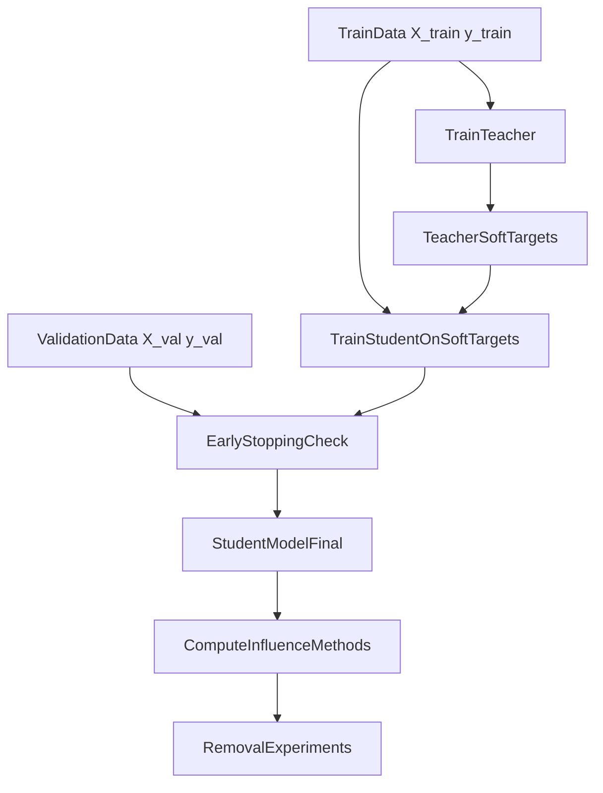
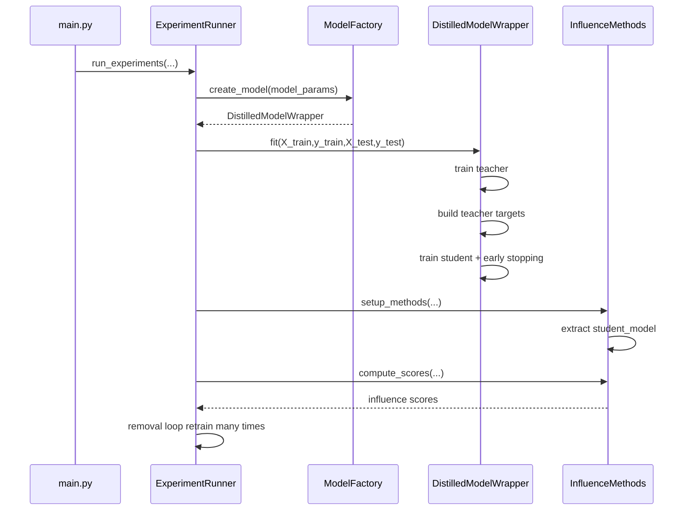

# Подробно о дистилляции в проекте

Этот документ объясняет:

- что такое knowledge distillation (KD) в общем виде;
- как именно KD реализована в этом репозитории;
- почему это важно для `influence` и `removal` экспериментов;
- где обычно теряется время и как контролировать переобучение.

---

## 1) Что такое дистилляция простыми словами

**Дистилляция** — это когда более простая модель (`student`) учится повторять поведение более сложной/деревянной/ансамблевой модели (`teacher`).

Идея:

1. Обучаем `teacher` на `X_train, y_train`.
2. Считаем предсказания `teacher` на тех же данных (`soft targets`).
3. Обучаем `student` приближать эти предсказания.
4. Используем `student` для дальнейших шагов (в нашем случае — для influence-методов на PyTorch).

Зачем это нужно в вашем проекте:

- классические tree-модели (LightGBM/XGBoost/CatBoost/RF) не подходят напрямую под torch-influence;
- дистилляция строит PyTorch-аппроксимацию поведения учителя;
- influence считается по дифференцируемой student-модели.

---

## 2) High-level схема

---

## 3) Математика (коротко)

### 3.1 Регрессия

Teacher дает вещественный таргет `t(x)`.  
Student минимизирует, например, MSE:

`L = MSE(student(x), t(x))`

### 3.2 Бинарная классификация

Teacher дает вероятность класса 1: `p_teacher(x)`.  
Student выдает logit, затем через sigmoid получается вероятность.  
Лосс — `BCEWithLogitsLoss(student_logit, p_teacher)`.

### 3.3 Мультикласс

Teacher дает распределение по классам `q_teacher(x)` (через `predict_proba`).  
Student выдает логиты `z_student(x)`.  
Используется классический KD-лосс:

`L_KD = KL(log_softmax(z_student / T), q_teacher) * T^2`

где `T` — temperature.

Смысл `T`:

- больше `T` -> распределение мягче;
- student видит не только “правильный класс”, но и структуру “похожести” классов.

---

## 4) Как это реализовано в коде проекта

Ключевые места:

- фабрика моделей: `models/factory.py`
- обертка дистилляции: `models/torch_models.py` (`DistilledModelWrapper`)
- influence setup/compute: `influence/methods.py`
- запуск эксперимента: `experiments/runner.py`, `main.py`

### 4.1 Создание distilled-модели

В `ModelFactory` при `use_distillation=True`:

- создается `base_model` (`teacher`) выбранного tree-типа;
- создается `DistilledModelWrapper` c:
  - `student_architecture`
  - `distillation_epochs`
  - `temperature`
  - `task_type`.

### 4.2 Обучение (`DistilledModelWrapper.fit`)

Пайплайн внутри:

1. Тренируется `base_model` на train.
2. Считаются teacher-targets:
   - multiclass: `predict_proba` (или one-hot fallback);
   - binary: вероятность класса;
   - regression: численное предсказание.
3. Тренируется `student_model` на этих target.
4. Если передан `X_val`, применяется early stopping по distillation val-loss.
5. Загружается best checkpoint student.

### 4.3 Инференс после дистилляции

После `fit()` предсказание идет через **student**, чтобы:

- оценка качества;
- influence;
- removal-кривые

были согласованы с одной и той же моделью.

### 4.4 Influence-методы

В `InfluenceMethods` модель для torch-influence извлекается из wrappers с приоритетом:

1. `student_model` (для distilled);
2. обычная `nn.Module`;
3. вложенная `model` внутри wrapper.

Это критично, иначе influence мог считаться не на том объекте или не включаться вообще.

---

## 5) Почему removal может заметно замедляться

В removal-фазе модель переобучается много раз:

`время ~= #methods * #remove_points * #retrain_runs * cost(train_one_model)`

После улучшений KD:

- для каждого retrain есть train + val-проходы (early stopping check);
- influence-методы для distilled обычно реально активируются;
- при больших `distillation_epochs` это существенно увеличивает время.

---

## 6) Риски переобучения и как вы их контролируете

### Что помогает против overfit student

- early stopping по val-loss;
- архитектура `student` проще teacher;
- мягкие таргеты teacher (особенно при корректном `temperature`);
- разумное число эпох.

### Что может провоцировать overfit

- слишком большой `distillation_epochs`;
- слишком “тяжелый” student;
- маленький/шумный train;
- temperature слишком низкий (почти hard labels).

---

## 7) Практический тюнинг (рекомендуемые диапазоны)

Для быстрого старта (classification):

- `temperature`: 2.0-4.0
- `distillation_epochs`: 80-200
- `distillation_patience`: 20-40
- `student_architecture`: `simple` для speed, `improved` для качества

Для regression:

- temperature роли почти не играет (в текущей формулировке лосса), можно оставить `2.0`;
- основной контроль — эпохи + patience + размер student.

---

## 8) Отладка: как понять, что KD работает корректно

Чеклист:

1. `student` метрика близка к `teacher` (не обязательно идентична, но разумно близка).
2. Removal-кривые не “ломаются” на первых 1-2 точках без причины.
3. Top/Bottom influence выглядят осмысленно (не все нули/NaN).
4. Результаты между запусками относительно стабильны (при фиксированном `RANDOM_STATE`).

Если `student` сильно хуже teacher:

- уменьшите сложность teacher (иногда teacher переобучен);
- увеличьте `temperature` немного;
- попробуйте больше эпох, но с early stopping;
- проверьте корректность `predict_proba` для teacher.

---

## 9) Диаграмма потока внутри одного эксперимента

---

## 10) Короткий вывод

В вашем проекте дистилляция нужна не только для ускорения/компрессии, но и как **мост** от tree-моделей к torch-influence.  
Методологически важно, чтобы:

- student действительно учился на soft targets teacher;
- валидация/early stopping контролировали overfit;
- influence и финальная оценка/removal использовали одну и ту же модель (student после дистилляции).

Именно это дает интерпретируемые influence-результаты без логических несостыковок.
